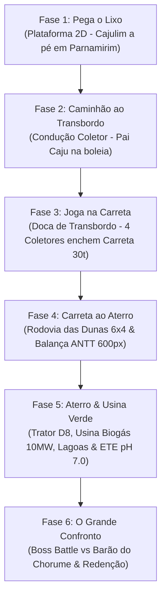

# GUIA DEFINITIVO DO PROJETO: TURMA DO CAJULIM
> **Arquivo de Continuidade para Nova IA**  
> *Data de Atualização: Setembro de 2026*  
> *Repositório: `marxb50/jogo-cajulim`*  
> *Objetivo deste documento: Garantir que qualquer nova IA assuma o projeto com contexto 100% completo, sem quebrar nenhuma mecânica, regra visual, teste automatizado ou padrão estabelecido.*

---

## 🎩 Mensagem Inicial para a Nova IA
*Ah, mon cher ami!* Se você é uma nova IA lendo este arquivo, seja muito bem-vindo!  
Este projeto é um jogo educativo oficial de plataforma 2D e simulação arcade desenvolvido para a **Prefeitura de Parnamirim / RN (Secretaria Municipal de Limpeza Urbana - SEMUR/SELIM)**.

O usuário valoriza imensamente:
1. **Precisão técnica absoluta** (código limpo, modular, robusto, testado e funcionando).
2. **Respeito rigoroso às regras visuais e feedbacks anteriores** (especialmente as coisas que ele pediu para tirar ou ajustar).
3. **Comunicação amigável e refinada no estilo francês** (*"Ah, mon cher ami!...", "Voilà!...", "magnifique!..."*).

---

## ⚠️ REGRAS INVIOLÁVEIS (NUNCA QUEBRE ISSO!)

### 1. NUNCA COMITAR ARQUIVOS `.bat`
- O usuário possui scripts de inicialização locais no Windows (`jogar.bat`, `abrir_jogo.bat`, `fase 1.bat` a `fase 6.bat`, etc.).
- **NUNCA** adicione ou comite arquivos `.bat` no Git (`git add *.bat` é terminantemente proibido). Comite apenas arquivos de código (`game.js`, `PC/game.js`, `celular/game.js`, `audio.js`, `.html`, `.css`, etc.).

### 2. SINCRONIZAÇÃO OBRIGATÓRIA DOS ARQUIVOS DO JOGO
- O arquivo raiz `game.js` é a **fonte da verdade**.
- Toda alteração feita em `game.js` **DEVE SER COPIADA IMEDIATAMENTE** para:
  - `PC/game.js`
  - `celular/game.js`
- Comando PowerShell padrão:
  ```powershell
  Copy-Item -Path game.js -Destination PC/game.js -Force
  Copy-Item -Path game.js -Destination celular/game.js -Force
  ```
- O mesmo vale para alterações em `audio.js` (sincronizar para `PC/audio.js` e `celular/audio.js`).

### 3. FASE 3: O CAMINHÃO COLETOR DEVE SER LIMPO E NATURAL (SEM LUZES/TINTS)
- **Feedback explícito do usuário**: *"retire essa luz vermelha amarela e verde do coletor"*.
- **O que NUNCA fazer no caminhão da Fase 3**:
  - NÃO adicionar brilho neon no chão sob o caminhão (`underglow / radialGradient`).
  - NÃO adicionar tint/filtro translúcido colorido sobre o caminhão (`rgba(...)` com `fillRect` ou `shadowBlur`).
  - NÃO colocar luz de giroflex colorida no teto do caminhão alternando conforme a fase.
  - NÃO colocar plaquinhas flutuantes coloridas coladas acima do caminhão.
- **Como o caminhão DEVE ser**:
  - Pixel art puro e natural do caminhão azul (`sc_truck`), chassi (`sc_truck_chassis`), caçamba basculante (`sc_truck_bed`), calços de roda amarelos/pretos, pistão cromado e o **Pai Caju** dirigindo na cabine.
  - As cores **Vermelho, Amarelo e Verde** pertencem **EXCLUSIVAMENTE** à barra de interface do minigame de mira no topo da tela!

### 4. FASE 3: CICLO DE 4 CAMINHÕES COLETORES (4 x 7.5t = 30.0t) E MIRA HIDRÁULICA
- **Feedback explícito do usuário**: *"vc tirou o negocio q vica andando de um lado pra o outro e tipo jogos de flecha e et quero 4 coletores pra encher a carreta"*.
- **Ciclo completo**: Exatamente **4 caminhões coletores** se revezam para encher a carreta semi-reboque de 30 toneladas:
  - Caminhão 1: 7.5t (Carreta vai para 7.5t / 25%)
  - Caminhão 2: 7.5t (Carreta vai para 15.0t / 50%)
  - Caminhão 3: 7.5t (Carreta vai para 22.5t / 75%)
  - Caminhão 4: 7.5t (Carreta vai para 30.0t / 100%)
- **Minigame de Mira ("jogos de flecha")**:
  - Uma barra no topo (`gaugeX = 310, gaugeY = 105, gaugeW = 340, gaugeH = 30`) com agulha e ponta de flecha oscilando continuamente de um lado para o outro.
  - **VERDE (Centro - Sweet Spot)**: Acerto perfeito! +500 pts, pressão máxima, despeja todo o restante do caminhão (até 7.5t).
  - **AMARELO (Intermediário)**: Bom! +200 pts, pressão média, despeja +2.5t (1/3 do caminhão) e a agulha volta para o jogador tentar descarregar o resto.
  - **VERMELHO (Bordas externas)**: Falha! +10 pts, baixa pressão, 0t despejadas, a agulha reseta para tentar novamente.
- **Despejo visual contínuo**: O lixo (sacos pretos amarrados, garrafas PET azuis, latinhas vermelhas/amarelas e caixas de papelão) sai da boca da caçamba basculante inclinada a 40°, escorrega pela calha da doca e cai dentro do container da carreta.
- **Lona de segurança**: Ao completar 30t no 4º caminhão, a lona verde com borda amarela rola sobre o container, a buzina soa e a fase conclui.

### 5. FASE 4: BALANÇA RODOVIÁRIA ANTT DE 600px
- **Feedback do usuário**: *"gostaria que fosse maior para que toda carreta coubesse nela e sobre o video da carreta vc colocou um caminhao coletor tem que ser a carreta em cima da balanca"*.
- A plataforma da balança de pesagem da ANTT mede **600px de comprimento** (`scaleX = 4050, scaleW = 600, scaleY = 330`), com pórtico metálico duplo, painel eletrônico digital central e célula de pesagem para acomodar **todo o conjunto cavalo mecânico + semi-reboque**.

### 6. TEXTOS E BORDAS ("letra fora do quadrado")
- Todos os balões de diálogo (Supervisor Cajulim, Pai Caju, Barão) e os cartões de HUD devem calcular dinamicamente a largura do texto usando `ctx.measureText(text).width` com margem extra generosa, evitando qualquer corte, colisão ou texto vazando das caixas.

---

## 🗺️ MAPA GERAL DAS 6 FASES DO JOGO



### FASE 1: PEGA O LIXO (PLATAFORMA URBANA 2D)
- **Personagem**: Cajulim a pé, com animações ricas de andar, pular e comemorar com os sapatos oficiais.
- **Cenário**: Ruas de Parnamirim, calçadas, faixas de pedestre, árvores regionais, muros institucionais e lixeiras da Coleta Seletiva.
- **Objetivo**: Coletar sacos de lixo (mínimo 6) e recicláveis espalhados, saltar sobre poças e entulho, depositar nas lixeiras coloridas e alcançar a linha de chegada.
- **Controles**: Setas/AD para mover, Espaço/W para pular (com coyote time e jump buffer).

### FASE 2: CAMINHÃO AO TRANSBORDO (CONDUÇÃO DO COLETOR)
- **Personagem**: Pai Caju dirigindo o caminhão coletor azul (`sc_truck`).
- **Cenário**: Avenidas urbanas em direção à Estação de Transbordo, viadutos, buracos de pista e cones de trânsito.
- **Objetivo**: Conduzir o caminhão, coletar galões de biodiesel B20 e chaves inglesas de manutenção, saltar sobre viadutos e desníveis de pista usando o impulso hidráulico, e atracar no portão da Estação de Transbordo.
- **Física**: Aceleração, suspensão oscilante, freio motor.

### FASE 3: JOGA NA CARRETA (ESTAÇÃO DE TRANSBORDO)
- **Personagem / Veículos**: Caminhão coletor basculante na doca superior; Carreta de 30 toneladas no fosso inferior; Supervisor Cajulim na passarela metálica superior.
- **Ciclo de 4 Caminhões Coletores**:
  - `TRUCK_ENTER`: Caminhão entra na doca pela esquerda.
  - `DOCKING`: Manobra de marcha à ré até a calha (`dockTargetX = 345`).
  - `ALIGNED`: Travamento de rodas com calços de segurança (+200 pts).
  - `TIMING_GAME`: Minigame da mira da agulha/flecha horizontal.
  - `DUMPING`: Pistão hidráulico estende, caçamba ergue a 40°, lixo desce pela calha e enche a carreta.
  - `TRUCK_EXIT`: Caminhão descarregado acelera para a esquerda e sai. Entra o próximo coletor!
  - `COMPACTING` (após o 4º caminhão): Lona verde de segurança rola sobre a carreta de 30t, buzina toca e a fase finaliza.

### FASE 4: CARRETA AO ATERRO (RODOVIA & BALANÇA ANTT)
- **Personagem / Veículo**: Cavalo mecânico azul traçado + Carreta semi-reboque graneleira verde de 30 toneladas com lona.
- **Cenário**: Rodovia litorânea com dunas douradas do RN, subidas íngremes e descidas sinuosas.
- **Mecânicas**:
  - **Tração Reduzida 6x4**: Ativada nas subidas fortes (Segurar Espaço / W).
  - **Freio Motor**: Ativado nas descidas (Seta Baixo / S) para manter estabilidade da carga em 100%.
  - **Balança ANTT (Posto de Pesagem)**: Plataforma elevada de 600px (`x: 4050 a 4650`). O caminhão para completamente sobre ela, o pórtico faz a leitura eletrônica (`30.000 kg OK 🟢`), a cancela se abre e o caminhão segue para o aterro.

### FASE 5: ATERRO SANITÁRIO & USINA VERDE (ENGENHARIA AMBIENTAL)
- **Nível multifásico de simulação técnica**:
  1. **Setor 1 - Célula de Disposição & Trator de Esteira**: O jogador opera o trator compactador de lixo Caterpillar D8 com lâmina frontal, nivelando e compactando o lixo a 100%, seguido da cobertura com camada impermeável de argila/solo.
  2. **Setor 2 - Usina Termelétrica a Biogás**: Drenos captam o gás metano (CH4) da decomposição. O jogador regula a pressão do biogás entre 40 e 70 kPa para alimentar as turbinas e gerar **10.0 MW de eletricidade limpa** para o município.
  3. **Setor 3 - Lagoas de Tratamento & Laboratório ETE**: O chorume passa por 3 lagoas de aeração (acionamento de 3 aeradores de superfície) e é analisado no laboratório químico por Cajulim até alcançar o efluente tratado neutro com **pH 7.0**.

### FASE 6: O GRANDE CONFRONTO FINAL (BOSS BATTLE & REDENÇÃO)
- **Vilão**: Barão do Chorume em sua máquina monstruosa de sucata poluente.
- **3 Fases do Combate**:
  - *Fase 1 (4 HP)*: Barão ataca com a pá de sucata. O jogador pula sobre a cabine nos momentos de vulnerabilidade.
  - *Fase 2 (3-2 HP)*: Barão dispara pneus em chamas e manchas de óleo tóxico pela arena.
  - *Fase 3 (1 HP)*: Sobrecarga de chorume radioativo, raios e trovões no cenário. Golpe final!
- **Redenção Educativa**: O Barão é derrotado, arrepende-se de poluir a cidade e cumpre **Serviço Comunitário**, varrendo e recolhendo lixo nas ruas de Parnamirim ao lado de Cajulim e sua turma!
- **Vitória Triunfal**: Troféu de Ouro da Limpeza Urbana e tela final de celebração.

---

## 💻 ESTRUTURA DO CÓDIGO E ARQUITETURA

### Localização dos Arquivos Principais:
- `game.js`: Motor principal da versão web (Canvas 2D, loop a 60 FPS, física, colisões, estados, renderizadores).
- `PC/game.js`: Cópia espelho exata de `game.js` para a versão PC.
- `celular/game.js`: Cópia espelho de `game.js` para celular.
- `PC/index.html` e `celular/index.html`: Páginas com viewport escalado, suporte a controles de teclado e botões touch virtuais.
- `audio.js`: Sistema de áudio procedural que usa Web Audio API (senoides, ruídos, envelopes ADSR) para todos os efeitos sonoros sem depender de arquivos externos pesados, além de síntese de voz para as falas dos personagens.

### Como Rodar o Servidor Local:
```powershell
# Iniciar servidor HTTP na porta 8000
python -m http.server 8000
```
- Acessar no navegador:
  - Menu principal: `http://127.0.0.1:8000/index.html`
  - Versão PC: `http://127.0.0.1:8000/PC/index.html`
  - Versão Celular: `http://127.0.0.1:8000/celular/index.html`

### Parâmetros de URL para Testes Imediatos:
Você pode abrir o jogo diretamente em qualquer fase e estado passando parâmetros na URL:
- Testar Fase 1: `http://127.0.0.1:8000/PC/index.html?phase=1&autostart=1`
- Testar Fase 2: `http://127.0.0.1:8000/PC/index.html?phase=2&autostart=1`
- Testar Fase 3 (Mira Hidráulica): `http://127.0.0.1:8000/PC/index.html?phase=3&autostart=1&state=TIMING_GAME`
- Testar Fase 3 (Despejo do Lixo): `http://127.0.0.1:8000/PC/index.html?phase=3&autostart=1&state=DUMPING`
- Testar Fase 3 (Carreta Completa): `http://127.0.0.1:8000/PC/index.html?phase=3&autostart=1&state=COMPACTING`
- Testar Fase 4 (Na Balança ANTT): `http://127.0.0.1:8000/PC/index.html?phase=4&autostart=1&pos=4050`
- Testar Fase 5 (Biogás): `http://127.0.0.1:8000/PC/index.html?phase=5&autostart=1&state=BIOGAS_GENERATION`
- Testar Fase 6 (Boss Battle): `http://127.0.0.1:8000/PC/index.html?phase=6&autostart=1`

---

## 🧪 SUÍTE DE TESTES AUTOMATIZADOS (EXECUTE SEMPRE!)

Sempre que alterar o código, **execute os testes em Node.js** para ter 100% de certeza de que nada quebrou:

1. **Teste Completo das 6 Fases**:
   ```bash
   node test_phases_playthrough.js
   ```
   *Deve passar com `PASS: ALL 6 PHASES COMPLETED WITH 100% SUCCESS!`.*

2. **Teste Específico da Mecânica da Mira da Fase 3**:
   ```bash
   node test_timing_mechanics.js
   ```
   *Verifica: Vermelho = 0t despejadas; Amarelo = +2.5t parciais; Verde = despejo do restante e saída.*

3. **Captura Visual com Chrome Headless** (se quiser inspecionar a interface):
   ```powershell
   & "C:\Program Files\Google\Chrome\Application\chrome.exe" --headless --disable-gpu --window-size=1000,650 --screenshot="screenshot_teste.png" "http://127.0.0.1:8000/PC/index.html?phase=3&autostart=1&state=TIMING_GAME"
   ```

---

## 📌 HISTÓRICO DE AJUSTES E DECISÕES IMPORTANTES

| Data / Sessão | Solicitação do Usuário | O que foi feito |
|---|---|---|
| Setembro 2026 | *"o caminhao muda de cor quando é pra colocar no verde amarelo ou vermelho..."* | Criada a barra de mira com zonas Vermelha/Amarela/Verde e agulha oscilante. |
| Setembro 2026 | *"gostaria que ele jogasse lixo nao essa fumaca... sacos de lixo sobre a balanca... carreta coubesse nela"* | Substituído efeito de fumaça por partículas reais de lixo e recicláveis; Balança ANTT ampliada para 600px. |
| Setembro 2026 | *"o lixo ta caindo fora do caminhao"* | Corrigido ponto de pivô e inclinação da caçamba; criada a calha guia que canaliza o lixo para dentro do semi-reboque. |
| Setembro 2026 | *"letra fora do quadrado"* | Ajustadas fontes e larguras dinâmicas de balões de fala e cartões superiores de HUD. |
| Setembro 2026 | *"retire essa luz vermelha amarela e verde do coletor e eu quero o lixo saindo dele e entrando na careta quero tbm que mostre a carreta enxendo..."* | Removidas todas as luzes neon, tints e badges coloridos do caminhão; Monte de lixo sobe visivelmente no container da carreta até 30t. |
| Setembro 2026 | *"vc tirou o negocio q vica andando de um lado pra o outro e tipo jogos de flecha e et quero 4 coletores pra encher a carreta"* | Restaurado o minigame da mira com a flecha oscilante e implementado o ciclo consecutivo de 4 caminhões coletores (4 x 7.5t = 30.0t). |

---

## 🤝 MODO DE TRABALHO RECOMENDADO PARA A NOVA IA

1. **Leia sempre o feedback anterior do usuário com atenção redobrada**.
2. **Não invente features que alterem o estilo visual sem autorização**: Mantenha o pixel art limpo e nostálgico.
3. **Mantenha os arquivos `game.js`, `PC/game.js` e `celular/game.js` idênticos**.
4. **Rode os testes automatizados antes de dar qualquer tarefa como concluída**.
5. **Comunique-se em tom cordial, técnico e com o charme do sotaque francês (*"Ah, mon cher ami!"*)**, pois o usuário já se acostumou e aprecia essa parceria divertida e produtiva!

*Bonne chance, mon cher ami! O projeto está em perfeito estado e pronto para brilhar!* 🚛✨
